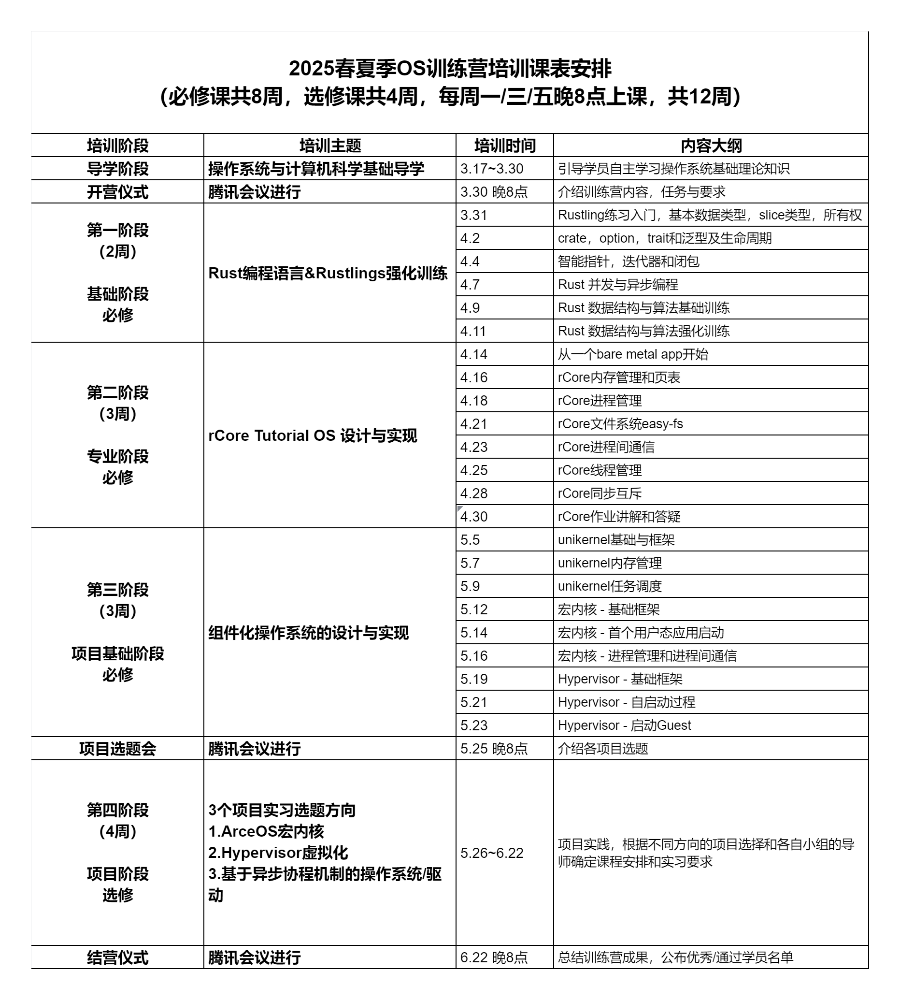
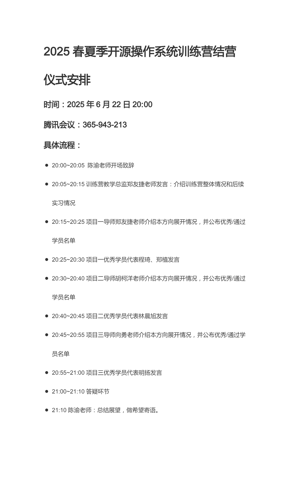

# 2025 年春夏季训练营总结

> Manager: 郑友捷、徐堃元

本文档是对 2025 年春夏季训练营开展的工作整理和总结，以便后续负责人参考和开展工作。

## 整体时间线

以下为 2025 年训练营的课表安排：

在筹备阶段，需要进行如下工作：

### 确定讲授内容

2025 年春夏季训练营总体沿用了往届训练营的课表，即遵循如下安排：

- 第一阶段：2周，讲授 Rust 编程语言 & Rustlings 强化训练
- 第二阶段：3周，讲授 rCore Tutorial OS
- 第三阶段：3周，讲授组件化操作系统 ArceOS 设计
- 第四阶段：4周，项目实习

但在第四阶段，实习项目数量从 2024 年秋冬季的 4 个缩减为 3 个，去除了“ArceOS 单内核 Unikernel”方向，理由为该内容已在三阶段进行讲授，实习会更加侧重实际开发的内容。

这部分工作需要提前完成，以便确定讲师和安排时间。

### 确定讲师

往年的讲师基本由清华大学研究生与泉城实验室工程师组成，但在今年决定培养新的教学力量。因此我们面向往年的优秀学员开放报名，通过选拔确定训练营助教和讲师。

筛选讲师和助教的步骤如下：

1. 面向往年优秀学员发放招募通知

2. 面向报名学员进行面试，面试即挑选一门课程（一般为第一阶段课程，让其试讲 10 分钟）

3. 根据试讲情况，判断个人的讲课能力和答疑能力，选择让其担任讲师还是助教

在 2025 年春夏季，我们调整了授课队伍：

- 第一阶段：部分讲师由往年优秀学员担任

- 第二阶段：部分讲师由往年优秀学员担任，部分讲师仍由清华大学研究生担任

- 第三阶段：使用 2024 年秋冬季训练营录屏，不再安排讲师授课，但仍有助教答疑

在筹备阶段，需要提前确定第四阶段的内容和导师。课表安排为 [2025 年春夏季 OS 训练营培训课表安排](https://docs.qq.com/sheet/DSUhZVWZLYWJBYWZI?tab=BB08J2)。

### 完善网站与群聊

训练营过程中同学们沟通和求助的渠道有两个：

- 问答论坛：同学们可以在训练营的[官网论坛](https://opencamp.cn/os2edu/bbs)上可以进行求助提问和讨论，讲师和助教可以在这里进行回复。

- 微信群聊（主要）：针对每一个阶段，我们都会设置微信群聊，在群聊中进行求助、讨论和答疑，讲师的上课通知也可以在这里发布。当一个微信群聊满员或者进入新的阶段时，需要创立新的群聊。

在训练营的筹备以及正式阶段，需要同步更新网站信息，包括：

- [导学阶段](https://opencamp.cn/os2edu/camp/2025spring/stage/0)等每一个阶段的课程安排

- 课程学习群（网页右下角的按钮）：当前阶段的最新群聊

- 正式授课后的回放和讲义上传：如[第一阶段学习视频](https://opencamp.cn/os2edu/camp/2025spring/stage/1?tab=video)

> 导学阶段还需要上传一些自学视频，视频内容来源于清华大学操作系统课程录屏。可以找陈渝老师要资源。

对于网站信息的更新，需要在[训练营后台](https://admin.opencamp.cn/)进行，账户密码请联系徐堃元等往届管理员。

### 宣传材料定稿

训练营一般会通过微信等渠道宣传，所以需要以公众号形式传播。我们以 2024 年的训练营为例，介绍需要的宣传材料：

- 宣传文案：[2024清华大学秋冬季开源操作系统训练营报名开始
](https://docs.qq.com/doc/DT2tpa2ZrV1JRZEhk?nlc=1)

- 制作推送：[2024清华大学春夏季开源操作系统训练营报名开启](https://mp.weixin.qq.com/s/5y0KkHgyvDaVJN4tojg4jQ)

- 制作海报（如有需要）

排版和海报内容一般由李明老师找人负责，所以在确定了时间安排之后，只要简单复用并且润色一下文案即可（可以使用大模型）。如果有制作海报的需求，可以联系徐堃元获取海报模板并且替换内容，或者找李明老师也行。

## 第一阶段

第一阶段为 rustlings 课程，一般是参与率最高的课程（退出率也最高）。

### 开营仪式

在第一阶段正式开始前，会有一个开营仪式，一般通过腾讯会议的形式进行。需要提前安排一下开营仪式的时间与参与人员，今年的流程为 [2025 年春夏季开源操作系统训练营启动会流程](https://docs.qq.com/doc/DWEpOUUhYcWZQVHJ0)。

参与发言的嘉宾可以交由陈老师来确定，其他发言人可以根据今年的负责人和授课讲师来调整。

### 创建作业仓库

我们使用 Github Classroom 创建作业仓库并且下发。Classroom 链接为 [rustling-classroom](https://classroom.github.com/classrooms/19380377-rustling-classroom)。

创建 classroom 需要如下步骤：

- 初始化今年的作业仓库，验证 CI 的正确性
    - 参考往年的内容，创建一个 [Public Template](https://github.com/LearningOS/rustling-25S-template) 仓库，作为 classroom 的模板

    - rustlings 版本可能需要更新，保证编译和测试的正确性

    - 仓库 [CI](https://github.com/LearningOS/rustling-25S-template/blob/main/.github/workflows/rust.yml#L32-L70) 会向训练营网站的服务器发送本次测试的分数，因此需要在 [Action Secret](https://github.com/LearningOS/rustling-25S-template/settings/secrets/actions) 配置相关的 TOKEN（包括课程 ID、服务端 API 和 Token），并更新 CI 文件。这部分内容联系徐堃元等管理员获取。
        > 这个分数的发送其实从网安视角来看存在非常多的漏洞，包括但不限于没有鉴权、token 作为 secret 可能泄露等等，但是往年基本没有人会在乎去攻击与作弊。

    - 更新相关文档到 2025 年春夏季

- 建立一个新的 classroom，可以按照往年的命名格式

- 选择创立好的模板仓库之后，classroom 会自动创建一个仓库，并且将模板仓库的代码复制到这个仓库中

- 模板仓库会生成一个邀请链接，将这个邀请链接发给学员，让他们加入 classroom

### 发布公告

当创建了作业仓库之后，需要发布课程公告，公告内容详见[第一阶段公告](./2025-spring-scheduling-1.md)。

公告需要同步发布在微信群聊，让同学们了解课程内容。

### 课程授课
每次课程开始前，需要提前约一个小时在群内（以群公告等形式）预告本次课程内容。

在课程结束之后，需联系讲师，并在[训练营后台](https://admin.opencamp.cn/)上传 PPT 和视频回放。

### 作业提交

作业提交方式详见[第一阶段公告](./2025-spring-scheduling-1.md)。提交作业之后需要联系训练营管理员，将其加入到下一阶段的群聊中。

作业提交时需要提交 Blog 到 [rcore-os/blog](https://github.com/rcore-os/blog)。负责人要注意 review 并 merge 相关的 PR。

## 第二阶段 —— 专业阶段

### 创建作业仓库

本阶段同时也需要在 Github Classroom 上创建作业仓库，Classroom 链接为 [rCore Tutorial ClassRoom](https://classroom.github.com/classrooms/19380377-os-rcore-classroom)。

创建步骤与第一阶段类似，此处不再赘述。这里主要介绍一下作业仓库的初始化的一些特点。

作业[模板仓库](https://github.com/LearningOS/rCore-Camp-Code-2025S)是在清华大学操作系统课程作业仓库 [rCore-Tutorial-Code](https://github.com/LearningOS/rCore-Tutorial-Code-2025S) 的基础上加入了一些特殊的 CICD 任务，用于评测作业。

每年清华大学的作业仓库都可能更新，因此建议模板仓库**基于新一年的作业仓库，而不是往年的模板仓库**。在创建了模板仓库之后，即可按照上述流程创建作业仓库并且分发。在发布前需要测试一下仓库的测试功能是否正常，并且更新相对应的 Token 等标识。

### 发布公告

当创建了作业仓库之后，需要发布课程公告，公告内容详见[专业阶段公告](./2025-spring-scheduling-2.md)。

公告需要同步发布在微信群聊，让同学们了解课程内容。

课程授课和作业提交方式类似于第一阶段，此处不再赘述。

## 第三阶段 —— 项目基础阶段

### 创建作业仓库

本阶段同时也需要在 Github Classroom 上创建作业仓库，Classroom 链接为 [ArceOS ClassRoom](https://classroom.github.com/classrooms/19380377-arceos-classroom)。

作业[模板仓库](https://github.com/LearningOS/2025s-oscamp-stage3)来自于 ArceOS 的[训练仓库]((https://github.com/arceos-org/oscamp))，主要测试 ArceOS 的一些基础功能。在发布前需要测试一下仓库的测试功能是否正常，并且更新相对应的 Token 等标识。

但是训练仓库也有一些需要提高的地方，如：

1. 更加完善的 README

2. 目前仅支持 RISCV 架构，需要添加其他架构的测试

3. 完善代码框架，将 ArceOS 基座改为子模块等形式，方便跟进上游更新

后续有空可以尝试改进。

### 发布公告

当创建了作业仓库之后，需要发布课程公告，公告内容详见[项目基础阶段公告](./2025-spring-scheduling-3.md)。

公告需要同步发布在微信群聊，让同学们了解课程内容。

课程授课和作业提交方式类似于第一阶段，此处不再赘述。

## 第四阶段 —— 项目实习阶段

在第四阶段，不再安排实际授课，而是由不同导师带着参与开发实际工作。

第四阶段开始前需要有一个[启动会](https://docs.qq.com/doc/DSUtucU5qbFNZSEVw)，由每一个方向的导师来讲述该方向的工作。该会议也是通过腾讯会议的形式进行，需要提前确定时间，以便不同导师安排时间和编写讲义。

启动会之后，需要安排进入四阶段的同学的课题选择，参考 [2025 年春夏季四阶段信息](https://docs.qq.com/doc/DUGtzRHBaU2FTRWdz)。

可能存在部分同学不参与四阶段，或者选题后不参与工作。这种现象是正常的，因为训练营本质还是需要靠自学。

可以让项目导师安排每周进展会，这个看导师自己的安排。

## 结营仪式

四阶段结束之后，会有结营仪式，安排如下：

结营仪式需要由训练营负责人进行主持。2025 年春夏季的 PPT 详见[结营讲义](./assets/结营.pptx)。

